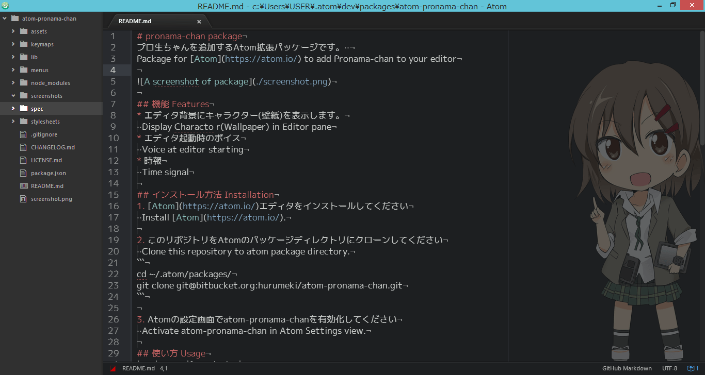
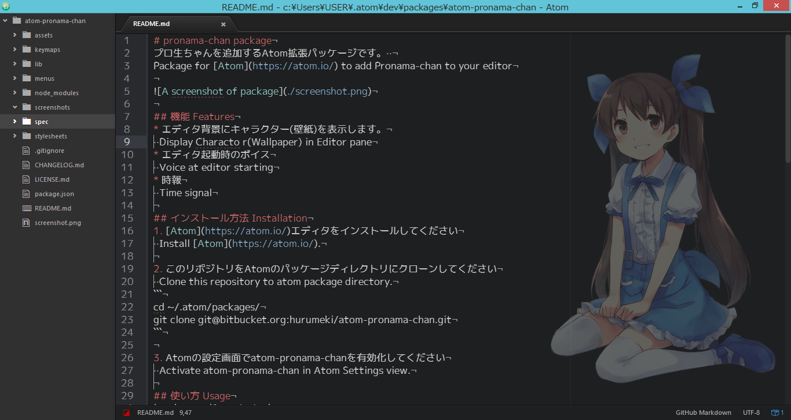
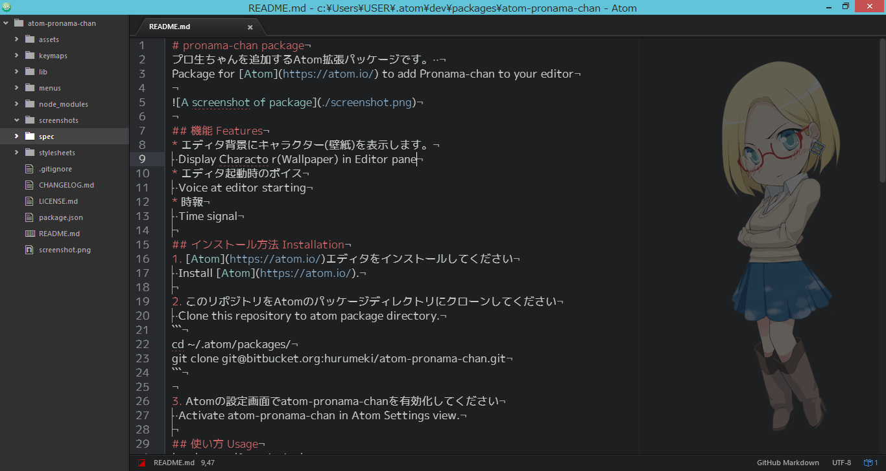
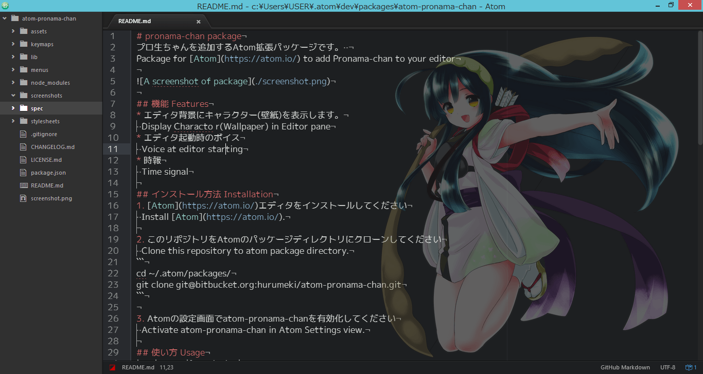

# pronama-chan package
プロ生ちゃんを追加するAtomパッケージです。  
Package for [Atom](https://atom.io/) to add Pronama-chan to your editor



## 機能 Features
* エディタ背景にキャラクター(壁紙)を表示します。  
  Display Characto r(Wallpaper) in Editor pane
* エディタ起動時のボイス  
  Voice at editor starting
* 時報  
  Time signal

## インストール方法 Installation
1. [Atom](https://atom.io/)エディタをインストールしてください  
  Install [Atom](https://atom.io/).

2. このリポジトリをAtomのパッケージディレクトリにクローンしてください  
  Clone this repository to atom package directory.
```
cd ~/.atom/packages/
git clone https://github.com/hurumeki/atom-pronama-chan.git
cd atom-pronama-chan
npm install
```

3. Atomの設定画面でatom-pronama-chanを有効化してください  
  Activate atom-pronama-chan in Atom Settings view.

## 自作アセットの追加 Adding original assets
`/assets`以下に、任意の名前のフォルダを作り、その中に以下の構造でファイルを配置します。  
config.jsonで、画像・音声のファイル名と用途を対応付けてください。  
[参考: プロ生ちゃんアセットのconfig.json](https://github.com/hurumeki/atom-pronama-chan-assets-pronama-chan/blob/master/config.json)  

```
/atom-pronama-chan
- assets
  - your_assets_name
    - config.json
    - image/
    - voice/
```

Atomを再起動し、コマンド`Pronama Chan: RoundTheme`で切り替えるか、atom-pronama-chanのSettingsから`ThemeDir`の値を作成したフォルダ名にすると、反映されます。

## 使い方 Usage
|Key|Events|Description|
|:-:|:-:|:-:|
|Ctrl + Alt + k|Pronama Chan Toggle|プロ生ちゃんの表示/非表示を切り替えます Toggle Pronama-chan view|
|Ctrl + Alt + l|Pronama Chan Round Theme|テーマを巡回して切り替えます Round Themes|

## テーマ
以下のテーマが含まれています。  
テーマによって機能に制限があります。  

|テーマ  　（Theme）|壁紙  （Wallpaper）|起動ボイス   （Voice）|時報  （TimeSignal）|
|:-:|:-:|:-:|:-:|
|プロ生ちゃん（暮井 慧）|○|○|○|
|美雲このは|○|×|×|
|美雲あんず|○|×|×|
|クラウディア|○|○|×|
|東北ずん子|○|×|×|
|ハッカドール１号|○|×|×|

## ライセンス LICENCE
### コード Codes
Released under the [MIT](https://github.com/tcnksm/tool/blob/master/LICENCE) license

### 画像、音声 Images and Voices
原則として、本作品以外での利用を禁止します。  
本作品以外で利用する場合は、個別に権利者に確認してください。  
各キャラクターの画像、音声は別リポジトリにあります。  
それぞれのリポジトリのREADME.mdを確認してください。

#### [プロ生ちゃん（暮井 慧）](http://pronama.azurewebsites.net/pronama/)

© 2011-2015 プログラミング生放送  
[リポジトリ](https://github.com/hurumeki/atom-pronama-chan-assets-pronama-chan)


#### [美雲このは](https://www.conoha.jp/blog/conoha)

©GMO Internet, Inc.  
本作品以外での利用を禁止します。  
[リポジトリ](https://github.com/hurumeki/atom-pronama-chan-assets-conoha)

#### [美雲あんず](http://cloud.gmo.jp/anzu/)

©GMO Internet, Inc.  
本作品以外での利用を禁止します。  
[リポジトリ](https://github.com/hurumeki/atom-pronama-chan-assets-anzu)

#### [クラウディア・窓辺 (Claudia Madobe)](http://msdn.microsoft.com/ja-jp/hh508969)

© 2011 Microsoft Corporation All Rights Reserved.  
[リポジトリ](https://github.com/hurumeki/atom-pronama-chan-assets-claudia)

#### [東北ずん子](http://zunko.jp/)

© 2016 SSS LLC.  
[リポジトリ](https://github.com/hurumeki/atom-pronama-chan-assets-zunko)

#### [ハッカドール１号](http://hackadoll.com/)
  
© DeNA Co., Ltd.  
[リポジトリ](https://github.com/hurumeki/atom-pronama-chan-assets-hackadoll1)
